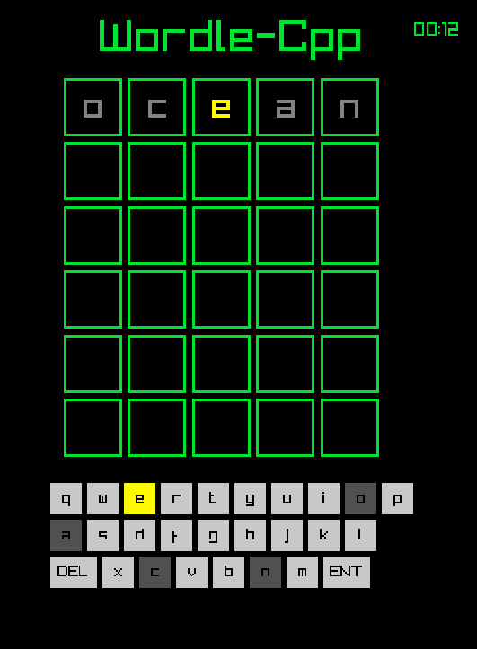

# Wordly-C++



## Overview

**Wordly-C++** is a desktop clone of the popular `Wordle` game, built using **C++20** and the **raylib** library. The game challenges you to guess a hidden 5-letter word in 6 attempts with real-time color feedback.

## Features

* **Dynamic Dictionary:** Loads almost 6000 popular 5-letter English words.
* **Anti-Cheat System:** Only valid dictionary words are accepted as guesses.
* **Customizable UI:** Change colors and themes via an external configuration file.
* **Cross-platform:** Easy to build using CMake.draw
* **Autoplay-feature** Autoplay playing mode is available
* **User's statistic** User can see playing statistic, such as `current streak`, `total wins`, `win attempt distribution`, `total lost games`, `best streak` and finally `total games played`

## Getting Started

### Prerequisites
* A C++20 compatible compiler (GCC, Clang, MSVC).
* CMake 3.10 or higher.
* Git.

### Installation & Build
```bash
# Clone the repository
git clone [https://github.com/quaslir/Wordly-C-](https://github.com/quaslir/Wordly-C-)
cd Wordly-C-

# Initialize raylib submodule
git submodule update --init --recursive

# Build the project
mkdir build && cd build
cmake ..
make

# Run the game (provide path to dictionary)
./Wordly-C++ ../dictionary.txt

```

## Configuration

You can customize the visual experience by editing the `config.conf` file. The game looks for this file in the root directory.

| Key | Value Example | Description |
| :--- | :--- | :--- |
| **BG_COLOR** | `BLACK`, `RAYWHITE` | Background color |
| **GRID_COLOR** | `GREEN`, `GRAY` | Color of the letter cells |
| **TEXT_COLOR** | `BLUE`, `WHITE` | Main UI text color |
| **HARD_MODE** | `TRUE`, `FALSE` | Harder playing mode (you must use a particular letter if it has previously been revealed)|

**Example `config.conf`:**
```conf
BG_COLOR=BLACK
GRID_COLOR=GREEN
TEXT_COLOR=BLUE
HARD_MODE=FALSE
AUTOPLAY=FALSE
```
## Controls

| Input | Action |
| :--- | :--- |
| **[A-Z]** | Type letters |
| **[Backspace]** | Remove last letter |
| **[Enter]** | Submit word for validation |
| **[Mouse]** | Navigate "Play Again" or "Exit" buttons |

## How It Works

Wordly-C++ uses a strict validation logic. To prevent **"vowel-spamming"** (e.g., typing `AEIOU`), every entry is checked against the internal dictionary. If a word doesn't exist in the database, it won't be accepted.

### Feedback System


* 🟩 **Green**: Letter is in the word and in the correct spot.
* 🟨 **Yellow**: Letter is in the word but in the wrong spot.
* ⬜ **Gray**: Letter is not in the word at all.

---
*Created by **Karl** as a Computer Science practice project.*